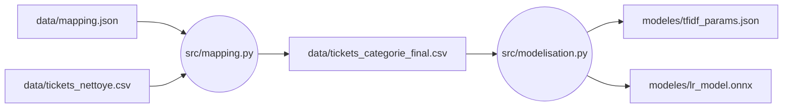

```mermaid
graph LR
    A[data/mapping.json] --> B((src/mapping.py))
    C[data/tickets_nettoye.csv] --> B
    B --> D[data/tickets_categorie_final.csv]
    D --> E((src/modelisation.py))
    E --> F[modeles/tfidf_params.json]
    E --> G[modeles/lr_model.onnx]


```
